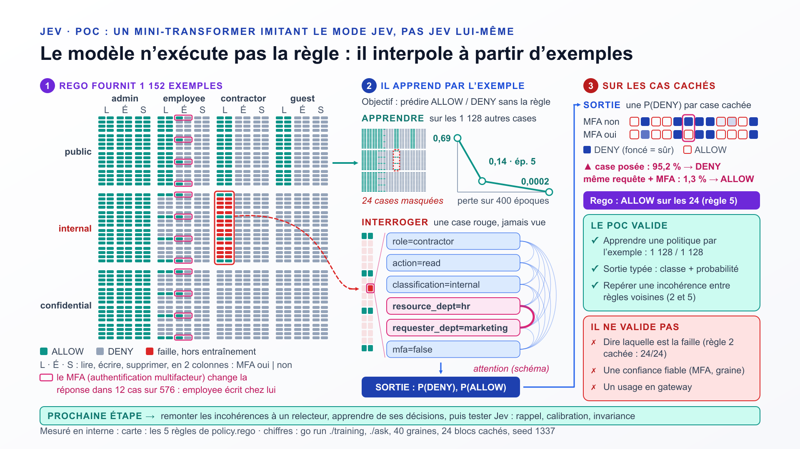

# Jev — mini-transformer « from scratch » : généraliser une politique d'accès

Un transformer minimal, écrit en Go sans framework de machine learning
(embeddings, self-attention, rétropropagation manuelle, SGD), appliqué à
un cas d'usage concret : apprendre à imiter une politique de contrôle
d'accès écrite en Rego, à partir d'exemples étiquetés par le moteur de
règles lui-même — puis observer, via un CLI, ce qu'il généralise là où la
règle littérale a ses limites.

L'objectif n'est pas la performance, mais de rendre visible, ligne par
ligne, ce qui se passe dans un transformer minimal — de l'embedding
jusqu'à la rétropropagation.

```
model/       le transformer + le vocabulaire (package model)
policy/      le domaine : requêtes d'accès, oracle Rego (Decide), sac de mots
training/    entraîne les deux modèles, écrit weights/policy-*.json
ask/         CLI : pose une requête, confronte Rego et les modèles
weights/     les poids sérialisés (JSON), produit de l'entraînement
```

> Le modèle n'a rien d'utile en production : c'est un objet d'étude.
> L'objectif est de comprendre ce que fait *vraiment* un transformer,
> en le construisant soi-même, ligne par ligne.

## Le POC en une image



1. **Rego fournit 1 152 exemples** : toutes les requêtes possibles,
   étiquetées par la politique ; en rouge, les 24 requêtes de la faille
   (règle 5), retirées de l'entraînement.
2. **Le modèle apprend par l'exemple** sur les 1 128 autres, puis on
   l'interroge sur une case rouge qu'il n'a jamais vue.
3. **Sur les cas cachés**, il contredit Rego sur 11 des 24, de façon
   instable. Le bilan dit ce que le POC valide et ce qu'il ne valide pas
   (détail dans « Ce que la mesure dit vraiment », plus bas).

Source de la slide : [`slides/one-slide-complex.md`](slides/one-slide-complex.md)
(Starlark, compilée avec `mdslides -format lecture`). Les autres decks sont
dans [`slides/`](slides/).

Documentation, au format [Diátaxis](https://diataxis.fr/) :

- [`PAS_A_PAS.md`](PAS_A_PAS.md) — **explication pas à pas** : comment le
  dataset est fabriqué depuis `policy.rego` et comment le modèle apprend,
  sans prérequis.
- [`TUTORIAL.md`](TUTORIAL.md) — **tutoriel** : embedding, entraînement,
  inférence, rôle de Rego, howto pour changer ou ajouter un classificateur.
- [`REFERENCE.md`](REFERENCE.md) — **référence** : paramètres (`lr`,
  `epochs`, `seed`, `DModel`…), sorties de l'entraînement et de
  l'inférence, formats des fichiers de poids.
- ce README — **explication** : la vue d'ensemble et le pourquoi des choix.

---

## Filiation : le mode de fonctionnement de Jev

Ce dépôt tire son nom et son mode de fonctionnement d'un modèle réel :
**Jev**, développé par TypeSafe AI et publié en 2026. D'après sa
[page Wikipédia](https://en.wikipedia.org/wiki/Jev_(AI_model)) et la
documentation éditeur, Jev n'est pas un LLM : il ne génère pas de texte.
Une requête Jev est un bloc d'*état* (chaîne, objet JSON ou tableau) plus
une ou plusieurs *questions typées* ; le modèle renvoie des valeurs
typées accompagnées de probabilités et d'un score de confiance, destinées
à être consommées par du logiciel. Les questions appartiennent à un jeu
de primitives défini à l'avance (`Choice`, `Score`, `Noul`), ce qui
interdit toute réponse hors schéma et, selon TypeSafe, l'hallucination.
Jev est décrit comme fondé sur un transformer, entraîné sur des données
synthétiques.

Le mini-transformer de ce dépôt reproduit ce **mode d'emploi** à l'échelle
d'un jouet :

| Aspect | Jev (TypeSafe AI) | Ce dépôt |
|---|---|---|
| Entrée | bloc d'état + questions typées | une requête d'accès sérialisée en six tokens `champ=valeur` |
| Question | primitive `Choice` / `Score` / `Noul` | un choix fermé binaire `{ALLOW, DENY}` (cas le plus simple de `Choice`) |
| Sortie | valeur typée + probabilités + confiance | classe choisie + `[P(DENY), P(ALLOW)]`, confiance affichée par `ask` |
| Génération de texte | non | non |
| Hors schéma | impossible | impossible : deux classes seulement |
| Fondation | transformer | transformer (self-attention, voir §2 du tutoriel) |
| Données | synthétiques | synthétiques : énumérées par `policy.All()`, étiquetées par l'oracle Rego |

Les différences, à garder en tête :

- **Échelle et moyens.** Jev est un modèle de production propriétaire ;
  ici, `DModel = 16` et une seule tête d'attention, entraînés sur 1128
  exemples.
- **Méthode d'entraînement.** TypeSafe indique entraîner Jev par RLCD
  (*Reinforcement Learning for Calibrated Decisions*), en optimisant les
  probabilités contre des résultats. Ce dépôt fait de l'apprentissage
  supervisé classique : entropie croisée et descente de gradient (SGD).
- **Architecture exacte.** Celle de Jev n'est pas publique (ni poids, ni
  article technique) ; la parenté décrite ici porte sur le mode
  d'entrée/sortie, pas sur une réimplémentation.

Ce projet est indépendant et **sans aucune affiliation avec TypeSafe AI**.
Le nom « Jev » est ici un clin d'œil pédagogique à ce mode de
fonctionnement : un modèle qui rend une décision typée et sa probabilité,
plutôt que du texte.

---

## Le cas d'usage

`policy/policy.rego` définit qui a le droit de faire quoi sur des
documents d'entreprise (lecture, écriture, suppression) selon le rôle du
demandeur, son département, le département et la classification du
document, et l'authentification MFA. Une des règles contient une faille
volontaire : un `contractor` peut lire n'importe quel document
`internal`, **sans vérification de département**.

Chaque exemple n'est pas une personne mais une **requête d'accès** —
`(rôle, action, classification, département du document, département du
demandeur, MFA)` — et le modèle apprend une fonction
`f(requête) → {ALLOW, DENY}`.

### Le rôle de Rego : oracle à l'entraînement, référence à l'inférence

Le modèle n'appelle jamais Rego, ni à l'entraînement ni à l'inférence :
c'est le modèle qui apprend à l'imiter. Mais Rego est bien **exécuté**,
par le vrai moteur OPA, comme oracle — par le programme d'entraînement
d'un côté, par le CLI de l'autre :

- **À l'entraînement**, le moteur OPA (SDK Go `opa/rego`) évalue
  `policy.rego` (`data.access.allow`) sur chacune des 1128 requêtes
  d'entraînement (`policy.Split()`). Sa réponse étiquette le dataset
  supervisé, régénéré à chaque `go run ./training`. La politique
  n'est pas dupliquée en Go : `policy.rego` est l'unique source de vérité,
  embarquée dans le binaire (`go:embed`).
- **À l'inférence**, le CLI confronte la prédiction des modèles à la
  réponse du moteur OPA sur la même politique, et met en évidence les cas
  où un modèle statistique **généralise** là où Rego exécute mécaniquement
  sa règle.

Étant donné un dataset supervisé, deux modèles sont entraînés côte à côte :

- le transformer de `model/` (embeddings + self-attention) ;
- `policy.BagOfEmbeddings`, un classifieur volontairement **sans**
  attention (moyenne d'embeddings + couche linéaire), pour comparer ce
  que le mélange entre positions apporte.

C'est ici que l'attention se justifie : la politique dépend de
**combinaisons** de champs (« employé ET même département »), pas
seulement de la présence d'un mot-clé — un signal qu'un mélange par
attention entre tokens peut représenter, contrairement à une moyenne
d'embeddings indépendants les uns des autres.

---

## Utilisation

```bash
go run ./training     # entraîne les deux modèles, sauvegarde leurs poids
go run ./ask -demo    # tableau comparatif Rego vs modèles sur 5 requêtes
```

Pour poser une requête précise :

```bash
go run ./ask -role=contractor -action=read -classification=internal \
             -resource-dept=hr -requester-dept=marketing
```

```
Requête : contractor read internal hr/marketing mfa=false

Résultat
  Rego (règle littérale)        : ALLOW
  Jev (avec attention)          : DENY (95.2%)
  Sac de mots (sans attention)  : DENY (85.8%)

  ⚠ Le modèle avec attention diverge de Rego.
```

### Le mode démo : généralisation vs règle littérale

`go run ./ask -demo` affiche un tableau sur des requêtes choisies :

| Requête | Rego | Ce que ça montre |
|---|---|---|
| `employee read public engineering/engineering` | ALLOW | cas ordinaire, tout le monde s'accorde |
| `guest delete confidential finance/marketing` | DENY | cas ordinaire, tout le monde s'accorde |
| `contractor read internal hr/hr` | ALLOW | règle 5 **apprise** (cas présent à l'entraînement) |
| `contractor read internal hr/marketing` | ALLOW | **faille tenue à l'écart** : le transformer prédit DENY (95,2 %) ; voir plus bas, 11 cas-faille sur 24 seulement |
| `intern read confidential hr/engineering` | DENY | rôle inconnu : token UNK côté modèle |

La ligne 4 est le cœur de la démonstration : les 24 requêtes-faille
(contractor + lecture + interne + département différent) n'ont jamais
été montrées au modèle. Rego applique sa règle 5 et répond ALLOW ; le
transformer, lui, a appris la règle 5 sur les cas *même-département*
restés dans le dataset, et a vu par ailleurs que les règles 2 et 3
exigent la correspondance de département : il généralise et répond DENY.
C'est une réponse que Rego, purement mécanique, **ne peut pas fournir** :
il ne sait pas signaler que sa propre règle 5 est suspecte.

Ce que la mesure dit vraiment (seed 1337, poids de `go run ./training`) :

- Sur les **24** requêtes-faille, le transformer en refuse **11** et suit Rego
  (ALLOW) sur les 13 autres. Il garde la règle 5 sur les 8 cas légitimes
  (même département).
- Ses réponses sont **tranchées dans les deux sens** : 10 cas au-dessus de
  95 % de DENY, 11 sous 2 %. Le 95,2 % de la ligne 4 vaut pour cette seule
  requête, pas pour le coin entier.
- La même requête avec `-mfa` donne **ALLOW** (P(DENY) = 1,3 %), alors
  qu'aucune règle de lecture n'utilise le MFA : la « correspondance de
  département » apprise est fragile.
- Le résultat dépend de la graine : sur les graines 1 à 40, de 0 à 21 refus
  (médiane 9). Voir `REFERENCE.md` §1.3.
- Le sac de mots dit aussi DENY sur la ligne 4, mais il n'a pas appris la
  règle 5 (0/8 sur les cas même-département) : il refuse tout contractor en
  lecture interne. Ce n'est pas de la généralisation.

Le désaccord est-il propre à la faille ? Deux contrôles (seed 1337) :

- **24 requêtes ordinaires tirées au hasard**, cachées en même temps que la
  faille (20 tirages) : 0,2 désaccord sur 24 en moyenne, contre 13,3 sur la
  faille. Le modèle complète correctement les trous dispersés.
- **Chacun des 24 blocs de la même forme que la faille** (rôle, action,
  classification, autre département), caché seul : 22 blocs complétés sans
  erreur (au plus 1 désaccord). Deux blocs seulement sont contestés :
  la faille (`contractor read internal`, 11/24) et la règle 2
  (`employee read internal`, **24/24**), pourtant correcte.

Les règles 2 et 5 sont voisines (lecture, interne, autre département) et se
contredisent (employee : DENY, contractor : ALLOW). Cachez l'une, le modèle
la prédit d'après l'autre. Il repère donc une **incohérence entre deux
règles voisines**, mais pas **laquelle est la faille** : c'est symétrique,
et la fausse alerte (24/24) est plus forte que la vraie (11/24). Sa
confiance n'est pas calibrée non plus. Ce qui reste : une incohérence
repérée est à trancher par un humain.

Une divergence n'est ni un bug ni une preuve que le modèle « comprend
mieux » l'intention de la politique : c'est le signe attendu qu'un
modèle statistique interpole à partir de ce qu'il a vu plutôt qu'il
n'exécute la règle exacte. L'intérêt est de rendre ce comportement
visible et comparable.

---

## Pistes d'évolution

- Un vrai jeu de validation aléatoire (en plus des 24 cas-faille) pour
  mesurer l'exactitude générale du modèle, pas seulement son
  comportement sur ce cas limite.
- Multi-têtes d'attention (plusieurs Wq/Wk/Wv en parallèle).
- Encodage positionnel (aujourd'hui l'attention est permutation-
  invariante par construction, ce qui suffit ici mais serait limitant
  sur des tâches sensibles à l'ordre des tokens).
- Une politique à trois issues ou plus (ALLOW / DENY / REVIEW) pour
  sortir du cas binaire.

Ce code est compilé et exécuté dans cet environnement (`go build ./...`,
`go vet ./...`, entraînement puis CLI).
